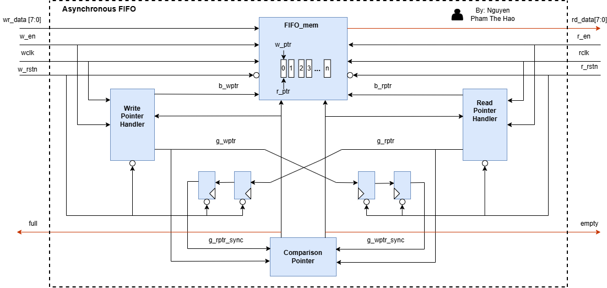
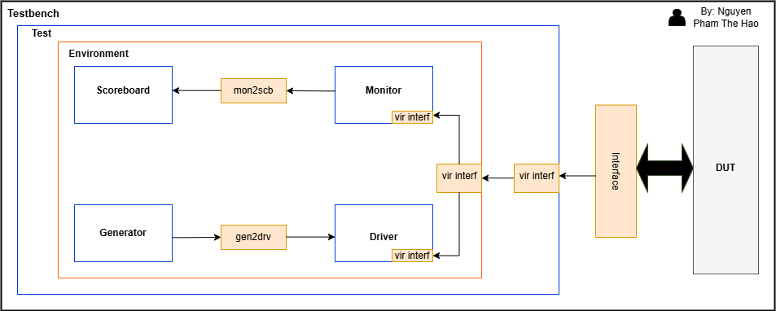
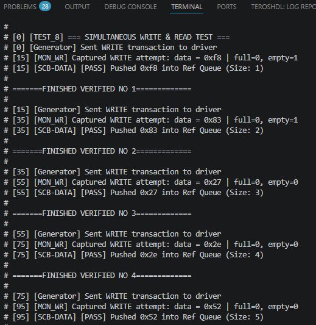
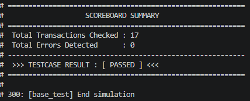
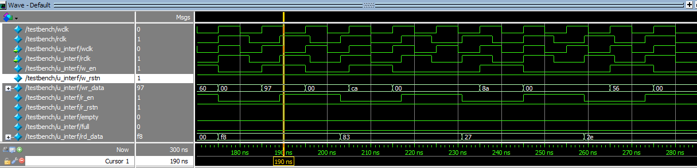

<!-- ABOUT THE PROJECT -->
## About The Project

This project focuses on building an Object-Oriented Programming (OOP) based Verification Environment in **SystemVerilog** to verify the functionality and timing behaviors of an **Asynchronous FIFO** (Clock Domain Crossing - CDC). 

The Asynchronous FIFO is a hardware component used to safely transfer data between two independent clock domains. Validating its behavior requires handling complex scenarios such as metastability, Gray code pointer synchronization, and pessimistic flag logic (`full` and `empty`).

The verification environment is designed with a layered architecture, including a Generator, Driver, Monitor, and a self-checking Scoreboard. It automatically executes various test scenarios to ensure the Design Under Test (DUT) operates correctly under all edge cases without data loss or corruption.

### Key Features

* **Asynchronous FIFO Core:** A synthesizable SystemVerilog implementation for safe data transfer between independent clock domains.
* **CDC Management:** Uses Gray code pointers and 2-FF synchronizers to resolve metastability and handle pessimistic `full`/`empty` flags.
* **SystemVerilog Verification Environment:** An OOP-based testbench architecture built with Environment, Generator, Driver, Monitor, and Scoreboard.
* **Scenario Generation:** Creates dynamic test cases covering normal operations, overflow, underflow, and simultaneous read/write conditions.
* **Self-Checking Scoreboard:** Compares DUT outputs against a reference queue with automated PASS/FAIL reporting.

* **FIFO Depth calculation:**
 `Buffer size= Burst size - Data read during burst write`
If write speed high as compared to read speed and data is continuous, design is not possible.
If write speed is high as compared to read speed, design is only possible if data is coming in the form of bursts and there is sufficient burst to burst gap.
### Project Architecture

#### DUT Architecture

#### Verification Environment

### Project Components

#### RTL Modules

* **[AsynFF.sv](rtl/AsynFF.sv)**: The top-level wrapper module that instantiates and interconnects all sub-components to construct the complete Asynchronous FIFO architecture.
* **[Comparison_Pointer.sv](rtl/Comparison_Pointer.sv)**: Compares the synchronized read and write Gray code pointers to generate `full` and `empty` status flags.
* **[FIFO_mem.sv](rtl/FIFO_mem.sv)**: The dual-port memory array block used for safely storing and retrieving FIFO data based on write and read addresses.
* **[Read_Pointer_Handler.sv](rtl/Read_Pointer_Handler.sv)**: Manages the read pointer logic, including binary incrementing for memory addressing and binary-to-Gray code conversion for safe cross-domain transmission.
* **[Write_Pointer_Handler.sv](rtl/Write_Pointer_Handler.sv)**: Manages the write pointer logic, handling binary incrementing and converting the write address into Gray code.

#### SystemVerilog Testbench

* **[Asyn_Pkg.sv](tb/Asyn_Pkg.sv)**: SystemVerilog package used to compile and import all verification class definitions.
* **[transaction.sv](tb/transaction.sv)**: Defines the base transaction class containing data, read/write control signals, and status flags used for communication between verification components.
* **[generator.sv](tb/generator.sv)**: Generates randomized or directed transactions for various test scenarios and sends them to the driver via a mailbox.
* **[driver.sv](tb/driver.sv)**: Receives transactions from the generator and drives the corresponding physical pin to the DUT through the virtual interface.
* **[monitor.sv](tb/monitor.sv)**: Samples the interface signals, reconstructs them into transaction objects, and forwards them to the scoreboard.
* **[scoreboard.sv](tb/scoreboard.sv)**: Compares expected data/flags against actual DUT outputs, tracks errors, and reports the final verification.
* **[environment.sv](tb/environment.sv)**: The container class that instantiates, the execution of the generator, driver, monitor, and scoreboard.
* **[interface.sv](tb/interface.sv)**: Defines the hardware signals bridging the class-based, object-oriented testbench with the static hardware DUT. 
* **[testbench.sv](tb/testbench.sv)**: The static top-level module that instantiates the DUT, connects it to the physical interface, and launches the execution of the verification environment.
### Verification Plan
The verification strategy is built upon a hybrid approach that combines dynamic simulation with assertion-based verification:
* **Testcases :** Used to drive specific stimulus into the DUT
* **SystemVerilog Assertions :** Placed inside the interface to monitor signals and catch design errors automatically as testcases run.

| Section | Testname | Description | SVA Checker (Assertion) | Method |
| :--- | :--- | :--- | :--- | :--- |
| **1. Reset check** | `reset_test` | After w_rstn, r_rstn are released, perform read access to value of FIFO. | • `chk_write_reset` • `chk_read_reset` | Directed |
| | `reset_at_middle_test` | 1. Write random value to FIFO, then release w_rstn, r_rstn. 2. Disable those reset signal, then check the value of FIFO. | • `chk_write_reset` • `chk_read_reset` | Directed |
| **2. Write & Read Operation** | `single_wr_rd_test` | Write 1 data to FIFO, wait, then read 1 data. Check if read data matches. | • `chk_wptr_inc_and_gray` • `chk_rptr_inc_and_gray` • `chk_multiclk_empty_deassert` | Directed |
| | `multiple_wr_rd_test` | Write 4 data continuously to FIFO, wait, then read 4 data. Check if all read data match. | • `chk_wptr_inc_and_gray` • `chk_rptr_inc_and_gray` | Directed |
| | `simultaneous_wr_rd_test`| Write and read data at the exact same time. Check if FIFO handles concurrent accesses correctly. | • `chk_wptr_inc_and_gray` • `chk_rptr_inc_and_gray` • `chk_multiclk_empty_deassert` | Directed |
| **3. Full & Empty State** | `overflow_test` | Write 20 data continuously to force FIFO full. Check if full flag is set to 1 and extra writes are ignored. | • `chk_no_write_when_full` | Directed |
| | `underflow_test` | Write 1 data, then try to read 5 times. Check if empty flag is set to 1 and extra reads are ignored. | • `chk_no_read_when_empty` | Directed |
| **4. Pointer Rollover** | `wrap_around_test` | Write 16 data, read 8 data, write 8 data, then read 16 data. Check if pointers roll over correctly and data matches. | • `chk_wptr_inc_and_gray` • `chk_rptr_inc_and_gray` | Directed |

### Achievements
#### Verification Data Flow

The log above illustrates the step-by-step data flow of the testbench during the execution of the SIMULTANEOUS WRITE & READ TEST. The verification components operate seamlessly across simulation timestamps:
* **Generator & Dirver**: Successfully construct and drive write/read transactions into the Design Under Test (DUT).
* **Monitor**: Accurately captures write operations and their payload data at exact sample edge
* **Scoreboard**: Receives monitored transactions and pushes them into the Reference Queue for automated comparison
#### Scoreboard Summary Report

Test Outcome: The testcase terminated cleanly with an explicit [ PASSED ] status at timestamp
#### Waveform
